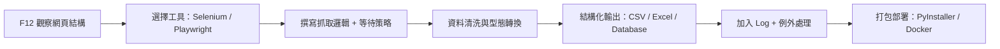

# 🕷️ 網頁爬蟲基本教學

> 本教學專為工程數據蒐集需求設計，涵蓋 Selenium/Playwright 工具選擇、動態網頁處理、資料清洗與結構化輸出，協助您穩定抓取政府公開資料。

---


## 📦 第一章：開發環境準備

### 必備套件安裝清單

| 套件名稱 | 安裝指令 | 用途說明 |
|---------|---------|---------|
| **Selenium** | `pip install selenium` | 模擬真人操作瀏覽器，適合初學者與現有專案 |
| **Playwright** | `pip install playwright` → `playwright install` | 現代化自動化工具，內建自動等待機制 |
| **Pandas** | `pip install pandas` | 🎯 工程師必裝！一鍵將 HTML 表格轉為 DataFrame/Excel |
| **Openpyxl** | `pip install openpyxl` | 支援 Python 讀寫 `.xlsx` 檔案，方便產出報表 |
| **PyInstaller** | `pip install pyinstaller` | 將 `.py` 腳本打包成 `.exe`，方便分享給非技術同仁 |
| **BeautifulSoup4** | `pip install beautifulsoup4` | 靜態網頁快速解析，速度比瀏覽器自動化快 10 倍以上 |
| **Loguru** | `pip install loguru` | 簡潔易用的日誌記錄工具，方便除錯與追蹤執行狀態 |

> 💡 **小提醒**：建議使用虛擬環境（`venv` 或 `conda`）隔離專案依賴，避免套件版本衝突。

---

## ⚔️ 第二章：工具選擇指南 — Selenium vs. Playwright

| 比較項目 | Selenium（經典老牌） | Playwright（現代新秀） |
|---------|-------------------|---------------------|
| **學習資源** | ✅ 豐富，StackOverflow 範例多 | ⚠️ 較新，但官方文件完整 |
| **自動等待** | ❌ 需手動撰寫 `WebDriverWait` | ✅ 內建智能等待，元素可操作才執行 |
| **執行速度** | 中等 | 🚀 更快，支援多標籤並行 |
| **瀏覽器支援** | Chrome/Firefox/Safari/Edge | Chrome/Firefox/WebKit（Safari 核心） |
| **安裝複雜度** | 簡單，只需 driver | 需額外執行 `playwright install` 下載瀏覽器核心 |
| **適合情境** | 快速驗證、現有專案維護 | 長期開發、複雜動態網頁、高穩定性需求 |

> 🎯 **建議**：若您目前的 Selenium 程式碼已穩定運行，可先維持現狀；若未來需擴展至全臺 22 縣市數據蒐集，或遇到大量動態載入網頁，**Playwright 會是更穩健的選擇**。

---

## 🛠️ 第三章：爬蟲開發四部曲（核心流程）

### 步驟 1️⃣：觀察與定位（Observation）

> 🎯 關鍵動作：按下 **F12** 開啟開發者工具

```markdown
✅ 目標分析：
   • 資料是否存在於原始 HTML？（檢視「Elements」分頁）
   • 還是點擊按鈕後才透過 API 載入？（檢視「Network」→ XHR/Fetch）

✅ 尋找「定錨點」（由優先到高）：
   • ID（最穩定）：`#cphContent_repReport_thDistrictCount`
   • Class（常用）：`.statis-table`、`tbody tr`
   • XPath（彈性搜尋）：`//td[contains(text(), '鳳山區')]`
   • CSS Selector：`table.statis-table > tbody > tr:nth-child(2) > td:nth-child(4)`
```

> 💡 **技巧**：在 Console 輸入 `$0` 可快速取得目前選取的 DOM 元素，測試 selector 是否正確。

---

### 步驟 2️⃣：獲取目標欄位（Dynamic Extraction）

以政府統計表格為例，若 HTML 結構如下：

```html
<tr>
  <td>鳳山區</td>   <!-- index 0 -->
  <td>120,500</td> <!-- index 1: 人口數 -->
  <td>58,200</td>  <!-- index 2: 男 -->
  <td>62,300</td>  <!-- index 3: 女 -->
  <td>45,000</td>  <!-- index 4: 戶數 -->
</tr>
```

```python
# 假設 cols 為 tr 內所有 td 的列表
cols = row.find_elements(By.TAG_NAME, 'td')

# 欄位對應（依實際網頁調整索引）
district = cols[0].text
population = cols[1].text.replace(',', '')  # 去除千分位
male = cols[2].text.replace(',', '')
female = cols[3].text.replace(',', '')
households = cols[4].text.replace(',', '')  # 原程式抓取此欄位
```

> ⚠️ **注意**：索引值會因網頁結構而異，務必先確認 `td` 的實際順序！

---

### 步驟 3️⃣：處理動態網頁（Dynamic Handling）

#### ❌ 常見錯誤：`stale element reference`

> 原因：網頁重新載入（Postback）後，舊的 DOM 元素參考已失效。

#### ✅ 正確做法：

```python
from selenium.webdriver.support.ui import WebDriverWait
from selenium.webdriver.support import expected_conditions as EC
from selenium.webdriver.common.by import By

# 【等待策略】取代 time.sleep()
wait = WebDriverWait(driver, 10)
wait.until(EC.presence_of_element_located((By.CLASS_NAME, "statis-table")))

# 【重新獲取】每次操作後（如翻頁、查詢），務必重新查找元素
rows = driver.find_elements(By.CSS_SELECTOR, ".statis-table tbody tr")
for row in rows:
    # 處理每一列資料...
    pass
```

#### 🔄 進階情境處理：

| 情境 | 解決方案 |
|-----|---------|
| 點擊「下一頁」後資料更新 | 操作後重新 `find_elements` + 等待新內容載入 |
| 資料捲動式無限載入 | 使用 `driver.execute_script("window.scrollTo(0, document.body.scrollHeight);")` 模擬捲動 |
| 按鈕需等待啟用才可點擊 | `wait.until(EC.element_to_be_clickable((By.ID, "btnSearch")))` |

---

### 步驟 4️⃣：資料清洗與驗證（Data Cleaning）

政府資料常見格式問題與處理方式：

```python
def clean_number(text):
    """去除千分位逗號、空白，並轉為數值"""
    return int(text.replace(',', '').strip())

def clean_text(text):
    """去除多餘空白與換行"""
    return ' '.join(text.split())

# 使用範例
population = clean_number(cols[1].text)
district_name = clean_text(cols[0].text)
```

> ✅ **建議**：在存入資料庫或匯出 Excel 前，先進行資料型態驗證（如 `isinstance(x, int)`），避免後續分析出錯。

---

## 📋 第四章：實戰檢查清單（Checklist）

遇到新網頁時，請依序確認以下項目：

| 步驟 | 檢查要點 | 應用範例（高雄民政局） |
|-----|---------|---------------------|
| **🔍 URL 分析** | 是否帶參數？是否為 `.aspx`/`.php`？ | `default.aspx?dt=...` → 典型的 ASP.NET 頁面 |
| **🏗️ 結構分析** | 資料在 `table`、`div` 還是 JSON API？ | 目標表格位於 `.statis-table > tbody` |
| **🖱️ 行為模擬** | 是否需先點擊「查詢」、「切換年份」？ | 預設即為最新資料，可省略點擊步驟降低錯誤率 |
| **⏱️ 載入時機** | 資料是同步渲染還是非同步載入？ | 觀察 Network 分頁是否有 XHR 請求 |
| **🛡️ 例外處理** | 網路中斷、元素找不到時如何反應？ | 使用 `try...except` 捕捉異常，並記錄至 GUI 狀態欄或 Log 檔案 |
| **💾 輸出驗證** | 匯出前檢查欄位完整性與數值範圍 | 確認「男 + 女 ≈ 人口數」，避免資料偏移 |

---

## 🧰 第五章：進階工具箱（提升效率與專業度）

### 🔹 Pandas：表格處理神器

```python
import pandas as pd

# 方法 1：直接解析網頁中的所有表格
dfs = pd.read_html(driver.page_source)  # 回傳 list of DataFrame
df = dfs[0]  # 取得第一張表格

# 方法 2：手動建構 DataFrame（彈性較高）
data = []
for row in rows:
    cols = row.find_elements(By.TAG_NAME, 'td')
    if len(cols) >= 5:
        data.append({
            '行政區': cols[0].text.strip(),
            '人口數': int(cols[1].text.replace(',', '')),
            '男性': int(cols[2].text.replace(',', '')),
            '女性': int(cols[3].text.replace(',', '')),
            '戶數': int(cols[4].text.replace(',', ''))
        })
df = pd.DataFrame(data)

# 匯出 Excel
df.to_excel('高雄人口統計.xlsx', index=False, engine='openpyxl')
```

### 🔹 Beautiful Soup：靜態網頁快狠準

```python
from bs4 import BeautifulSoup
import requests

# 若網頁無需登入、無 JS 動態載入，可用 requests + BS4 大幅提速
response = requests.get('https://example.gov.tw/data.aspx')
soup = BeautifulSoup(response.text, 'html.parser')

table = soup.find('table', class_='statis-table')
for row in table.find('tbody').find_all('tr'):
    cols = [td.text.strip() for td in row.find_all('td')]
    # 處理資料...
```

### 🔹 Loguru：專業級錯誤追蹤

```python
from loguru import logger
import sys

# 設定日誌輸出格式與檔案輪轉
logger.add("crawler_{time:YYYYMMDD}.log", rotation="10 MB", level="INFO")

try:
    # 您的爬蟲邏輯...
    pass
except Exception as e:
    logger.error(f"抓取失敗：{e}", exc_info=True)  # 記錄完整堆疊追蹤
```

---

## 🚨 第六章：常見問題與除錯技巧

| 錯誤訊息 | 可能原因 | 解決方案 |
|---------|---------|---------|
| `NoSuchElementException` | 元素尚未載入或 selector 錯誤 | 使用 `WebDriverWait` + 確認 selector 正確性 |
| `StaleElementReferenceException` | 網頁重新渲染後舊元素失效 | 操作後**重新查找元素**，避免重複使用舊變數 |
| 資料含 `NaN` 或空值 | 某些列結構不一致（如表頭、無資料列） | 加入 `if len(cols) >= 5: continue` 過濾異常列 |
| 千分位導致轉換錯誤 | `'120,500'` 無法直接轉 `int` | 先 `.replace(',', '')` 再轉換 |
| 中文亂碼 | 網頁編碼非 UTF-8 | `response.encoding = 'utf-8'` 或使用 `chardet` 自動偵測 |

> 💡 **除錯心法**：遇到問題時，先「手動在瀏覽器操作一次」，觀察網路請求與 DOM 變化，再比對程式行為差異。

---

## 🎓 第七章：總結與下一步建議

### ✅ 標準開發流程回顧



### 🚀 進階延伸建議

1. **參數化配置**：將 URL、selector、輸出路徑寫入 `config.yaml`，提升程式可維護性。
2. **模組化設計**：將「連線」、「抓取」、「清洗」、「輸出」拆分為獨立函式或類別。
3. **排程自動化**：搭配 Windows 工作排程器或 `cron`，每日自動執行資料更新。
4. **GUI 整合**：若需提供給非技術同仁使用，可用 `tkinter` 或 `PyQt` 包裝簡單操作介面。
5. **雲端部署**：考慮將爬蟲容器化（Docker），部署至 Colab / RunPod / 自建伺服器，實現 24 小時監控。

---

> 🌟 **最後一句提醒**：  
> 「爬蟲的本質是『模擬人類行為』，而非『暴力破解』。請務必遵守網站 `robots.txt` 規範，並控制請求頻率，避免對目標伺服器造成負擔。」

---

📬 **需要進一步協助嗎？**  
若您遇到以下情境，歡迎隨時提出：
- 資料為「捲動式無限載入」或「需登入驗證」
- 想分析 Network 分頁的 API 請求，直接抓取 JSON 資料
- 需要將爬蟲打包成 `.exe` 並加入圖形介面
- 想整合 QGIS / Pandas 進行空間資料分析

祝您爬蟲順利，資料精準！🔧📊
